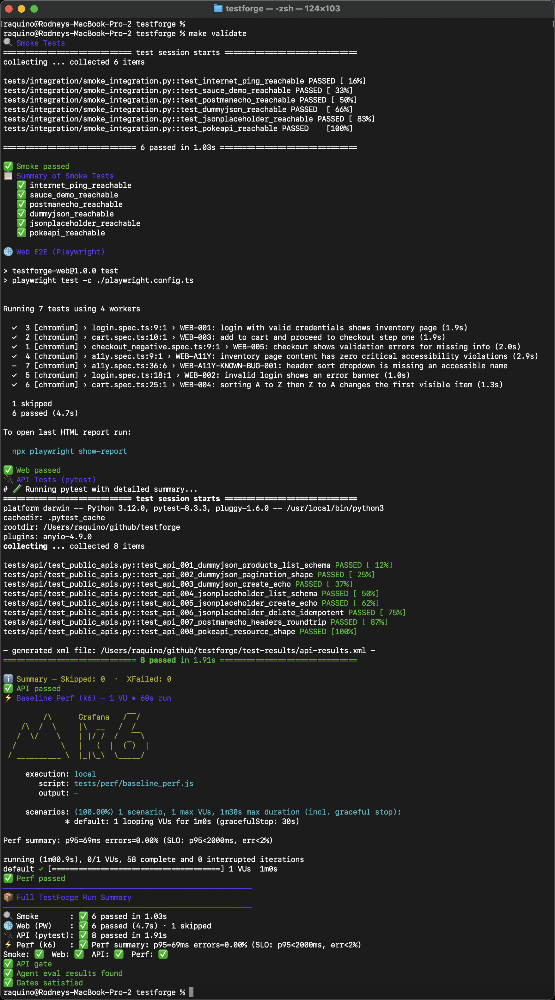

# 🔧 TestForge — Full-Stack QA Framework

A practical, full-stack QA toolkit that helps teams validate Web UI, APIs, performance signals, and agent behavior with confidence.  
It establishes reliable workflows and surfaces insights you can use to make informed decisions fast.

---

## 📋 Pre-Requisites

**Developed and tested on macOS**. For the smoothest setup experience on Mac, we recommend having [Homebrew](https://brew.sh/) installed.

- **Node.js 18+**: Required for Playwright and web test execution.  
- **Python 3.10+**: Required for API tests and agent evaluation scripts.  
- **k6** (optional): Required for performance testing; if missing, performance tests will be skipped gracefully.  
- **Homebrew** (macOS): Recommended package manager for installing Node.js, Python, and k6 on macOS.  
- Internet access to public demo APIs and services for testing.

---

## 🚀 Quick Start
```bash
git clone https://github.com/rodneyaquino/testforge.git
cd testforge
make setup
make test-all
make report
```

- `make setup` — Installs dependencies and creates necessary output folders.  
- `make test-all` — Runs all test suites: Smoke, Web UI, API, and Performance.  
- `make open-report` — Opens the Playwright HTML test report (macOS only).  
- `make validate` — Runs release readiness gates and enforces quality checks.

---

## 🧩 What It Covers

| Layer          | Tooling                     | Focus                                                        |
|----------------|-----------------------------|--------------------------------------------------------------|
| 🌐 **Web UI**   | Playwright                  | Login flows, cart and checkout, sorting, two negative scenarios, accessibility scan with axe-core. |
| 🔌 **Public APIs** | pytest + requests + jsonschema | Public demo APIs covering auth, CRUD, pagination, headers, schema contracts, idempotent operations. |
| ⚡ **Performance** | k6                         | Low-intensity micro-benchmark (1 Virtual User, ~1 RPS, 60s) designed to respect public API load limits. |
| 🤖 **Agentic AI** | Manual prompts + rubric     | Evaluations on JSON schema fidelity, citation correctness, safety refusals, instruction and distraction handling, multi-turn revisions. |
| 🧭 **Governance** | Strategy · Matrix · Bugs    | Traceable quality artifacts from requirements through release gates, with bug reports linked to tests. |
| 🔄 **CI/CD** | GitHub Actions | Automated test execution and quality gate enforcement on every push and pull request. |

---

## 🗂 Structure
```
testforge/
├── .github/
│   └── workflows/
│       └── ci.yml                                # GitHub Actions CI/CD workflow
├── .gitignore                                    # Git ignore patterns for dependencies and artifacts
├── .vscode/
│   └── settings.json                             # VS Code workspace settings
├── Makefile                                      # Orchestration entrypoint for setup, tests, and gates
├── README.md                                     # This file: project overview and setup guide
├── agent-evals/                                  # Agent evaluation suite with prompts and rubric
│   ├── README.md                                 # Agent evaluation overview and instructions
│   ├── prompts.md                                # Agent test prompts for reasoning, safety, and citations
│   ├── results-template.md                       # Template for recording agent evaluation results
│   ├── results.md                                # Completed agent evaluation results
│   ├── rubric.md                                 # Pass/fail grading rubric for agent responses
│   ├── transcripts/                              # Agent test transcripts with evidence
│   │   └── evidence/                             # Screenshots and evidence for agent tests
│   └── TEMPLATE.md                               # Template for creating new agent transcripts
├── reports/                                      # Bug reports and quality evidence
│   └── bugs/                                     # Bug tracking with detailed reports
│       ├── BUG_TEMPLATE.md                       # Template for filing new bug reports
│       └── evidence/                             # Bug evidence artifacts
├── strategy/                                     # Strategic planning and traceability
│   ├── TEST_STRATEGY.md                          # Comprehensive test strategy document
│   └── TRACEABILITY_MATRIX.md                    # Mapping of requirements to test coverage
└── tests/                                        # All test suites organized by layer
    ├── api/                                      # API test suite (pytest)
    │   ├── conftest.py                           # pytest fixtures and shared configuration
    │   ├── requirements.txt                      # Python dependencies for API tests
    │   └── test_public_apis.py                   # API contract and behavior tests
    ├── integration/                              # Integration and smoke tests
    │   └── smoke_integration.py                  # Reachability and smoke checks for services
    ├── perf/                                     # Performance testing suite (k6)
    │   ├── baseline_perf.js                      # k6 micro-benchmark script
    │   ├── perf_gate.py                          # Performance gate checker enforcing SLOs
    │   ├── PERF_PLAN.md                          # Performance testing plan and rationale
    │   └── results/                              # Performance test results (generated)
    │       └── k6-summary.json                   # k6 test summary with metrics
    └── web/                                      # Web UI test suite (Playwright)
        ├── a11y.spec.ts                          # Accessibility tests using axe-core
        ├── cart.spec.ts                          # Cart and sorting behavior tests
        ├── checkout_negative.spec.ts             # Negative checkout validation tests
        ├── login.spec.ts                         # Login flow tests (valid and invalid)
        ├── package.json                          # Node dependencies for Playwright tests
        └── playwright.config.ts                  # Playwright configuration settings
```

---

## 🧪 Gates (Release Readiness)

- ✅ All critical Web UI flows must pass.  
- ✅ Zero critical accessibility (a11y) violations on inventory page.  
- ✅ API contracts and schema validations pass without regressions.  
- ✅ Agent evaluation manual scoring meets or exceeds 80% pass rate.  
- ✅ Performance p95 latency below 2000 ms and error rate below 2%.  
- ✅ No open Critical bug reports blocking release.

These gates are automatically validated via:
```bash
make validate
```

**CI/CD automation:** The GitHub Actions workflow (`.github/workflows/ci.yml`) runs these gates automatically on every push to `main` or `develop` branches and on all pull requests.

---

## 🧭 Notes

- Web tests run in isolated browser contexts; setup and teardown are automatic and stateless.  
- API targets are public mocks designed for idempotency and statelessness; POSTs echo data, DELETes verify idempotency.  
- Performance tests are read-only and designed to be low-impact on public services.  
- Agent evaluations are recorded as transcripts and screenshots for manual review using a detailed rubric.
- CI/CD pipeline uploads test results and Playwright reports as artifacts for easy review.

---

## ⏱ Time Spent and Assumptions

**Estimated Time (~10 hours)**  
- 1.0 hour: Planning and strategy formulation  
- 2.0 hours: Playwright flows and accessibility testing  
- 2.5 hours: API suite development, including schema validations  
- 1.0 hour: Integration smoke test implementation  
- 1.0 hour: k6 micro-benchmark development and performance plan creation  
- 1.0 hour: Agent prompt design, rubric creation, and transcript collection  
- 1.5 hours: Documentation, traceability matrix, and CI pipeline gates setup

**Assumptions**  
- Public demo targets remain stable during testing window.  
- No private secrets or paid credentials are required.  
- All tests are idempotent and self-contained for reproducibility.  
- Agent evaluations use human-reviewed transcript evidence for scoring.

---

## 🧩 Helpful Commands

| Command          | Description                              |
|------------------|------------------------------------------|
| `make setup`     | One-time install of all dependencies and setup folders |
| `make test-all`  | Runs all test suites: Smoke, Web, API, and Perf  |
| `make report`    | Prints out report locations and artifact summaries |
| `make open-report` | Opens the Playwright HTML report (macOS only)  |
| `make validate`  | Runs all quality gates and enforces release criteria |
| `make clean`     | Cleans test results and temporary files |
| `make clean-all` | Deep cleans including node modules and Python packages |

---

## 📘 Included Artifacts

- `strategy/TEST_STRATEGY.md` — In-depth scope, risks, data management, and release gates  
- `strategy/TRACEABILITY_MATRIX.md` — Detailed mapping of test coverage to requirements  
- `agent-evals/prompts.md` — Prompt suite covering reasoning, safety checks, and citation fidelity  
- `agent-evals/rubric.md` — Pass/fail grading rubric for agent evaluations  
- `agent-evals/results-template.md` — Template for agent test result documentation  
- `tests/perf/PERF_PLAN.md` — Micro-benchmark design and resilience planning  
- `reports/bugs/*.md` — Bug reports with detailed evidence  
- `.github/workflows/ci.yml` — GitHub Actions CI/CD workflow automating test execution
- `Makefile` — Single orchestration command entrypoint

---

## 🎯 Purpose

TestForge is a simple, easy-to-learn QA framework that demonstrates how to test a complete software stack from end to end. It covers testing the web user interface, public APIs, performance, and AI agent behavior. The goal is to teach how to build clear, reliable tests that provide trustworthy evidence and readable reports across all these layers.

