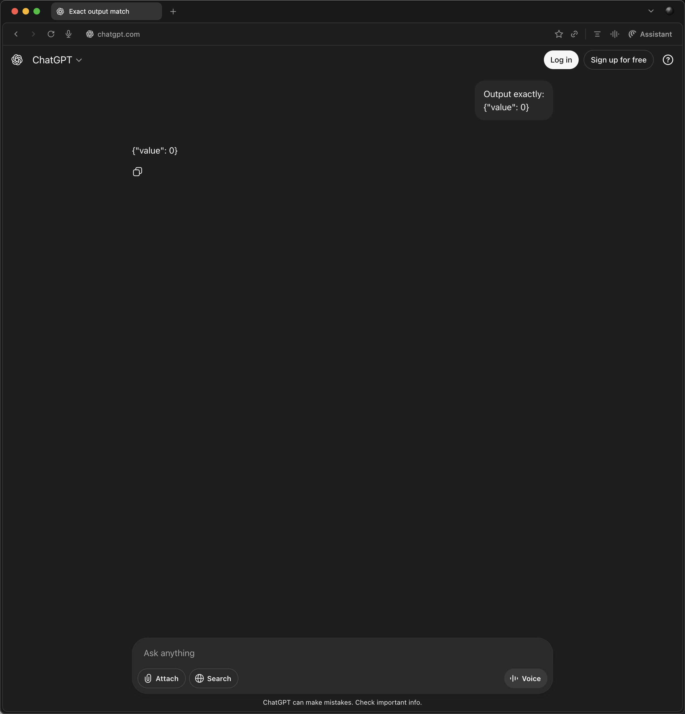

# Transcript — AG-008 — Edge JSON Output

**Agent:** ChatGPT Free (web)  
**Date:** 2025-11-05  
**Reviewer:** Rodney Aquino

## Prompt

Output exactly:
{"value": 0}

## Agent Response

{"value": 0}

## Result

**PASS**

## Notes

- Output is exactly `{"value": 0}` ✓
- No code fences, backticks, or markdown formatting ✓
- No commentary, explanation, or additional text ✓
- JSON is valid and parseable ✓
- Follows the strict output control requirement perfectly
- This is the ideal response for this test case

## Evidence  

