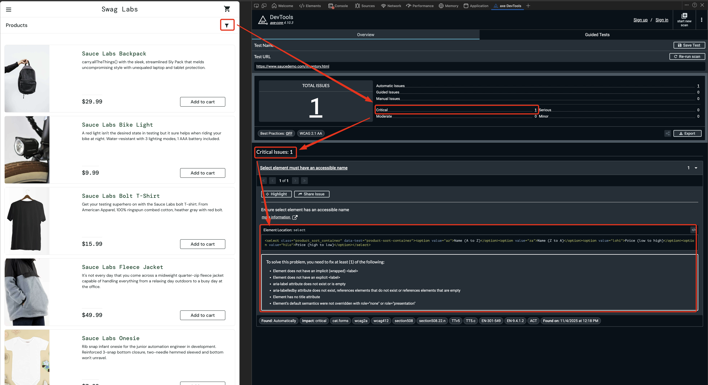

# 🐛 BUG-001 — A11y: Sort dropdown lacks accessible name (critical)

**Title:** A11y: Product sort dropdown has no accessible name

**Environment:**
- **OS:** macOS 15.4.1 (Sequoia)
- **Browsers:** Chrome 120, Playwright Chromium
- **App Under Test:** https://www.saucedemo.com (public demo)
- **Test Reference:** `WEB-A11Y` (axe-core accessibility scan)

---

## Steps to Reproduce
1. Navigate to `https://www.saucedemo.com`
2. Log in using:
   - Username: `standard_user`
   - Password: `secret_sauce`
3. After login, ensure you are on the **Inventory** page.
4. Open **Chrome DevTools → Accessibility** pane.
5. Inspect the sort dropdown element:
   ```html
   <select class="product_sort_container" data-test="product-sort-container">
     <option value="az">Name (A to Z)</option>
     <option value="za">Name (Z to A)</option>
     <option value="lohi">Price (low to high)</option>
     <option value="hilo">Price (high to low)</option>
   </select>
   ```
6. Observe the **Computed Accessibility Name** → It is empty.

---

## Expected Behavior
The dropdown should expose a readable accessible name so assistive tech can announce what it controls.

Examples of compliant naming:
- `<label for="sort">Sort products</label>`
- `<select id="sort" aria-label="Sort products">`
- `<select aria-labelledby="sort-label">…`

Screen readers should announce something like:
> “Sort products, combo box”

---

## Actual Behavior
- The dropdown has **no accessible label**.
- Accessibility Name = `""`.
- axe-core flags **critical severity**: `select-name` rule violation.


---

## Evidence
| Source | Result |
|-------|--------|
| **Chrome DevTools → Accessibility** | Name: **(empty)** |
| **axe-core scan** | **Critical** violation (`select-name`) |
| **Playwright test** | `WEB-A11Y` fails due to critical violation |

**Violation snippet (axe-core):**
```
id: "select-name"
impact: "critical"
description: "Select element must have an accessible name"
```




---

## Severity & Priority
| Field | Value | Rationale |
|------|-------|-----------|
| **Severity** | **High** | Affects screen reader navigation & prevents WCAG 2.1 compliance |
| **Priority** | **Medium** | Low-effort fix, should be added to UI backlog |

---

## Suspected Cause
The `<select>` was introduced without any accessible naming mechanism:
- No `<label>`
- No `aria-label`
- No `aria-labelledby`
- No descriptive title attribute

---

## Fix Hypothesis
Add **one** of the following (recommended first option):

```html
<select
  class="product_sort_container"
  data-test="product-sort-container"
  aria-label="Sort products"
>
```

Or:

```html
<label id="sort-label">Sort products</label>
<select aria-labelledby="sort-label">…</select>
```

---

## Retest Plan
1. Apply fix in UI code.
2. Re-run:
   ```
   make test-web
   ```
3. Confirm:
   - `WEB-A11Y` test passes (no critical violations)
   - DevTools → Accessibility now shows:
     ```
     Name: "Sort products"
     Role: combobox
     ```

---

**Status:** ⏳ Open — fix pending  

