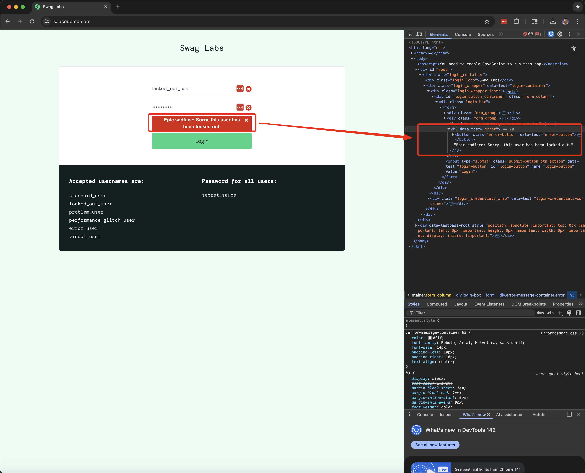

# 🐛 BUG-002-login-error-literal-sadface

**Title:** Login error message displays literal text "Epic sadface" instead of an actual sad-face emoji

**Environment:**
- **OS:** macOS 15.4.1 (Sequoia)
- **Browsers:** Chrome 142, Playwright Chromium 1.48
- **App Under Test:** https://www.saucedemo.com

---

## Steps to Reproduce
1. Navigate to https://www.saucedemo.com
2. Enter username `locked_out_user`
3. Enter password `secret_sauce`
4. Click Login
5. Observe the error banner displayed above the form

---

## Expected Behavior
- The login error should include a visual sad-face emoji (e.g., 😢 or ☹️) or a friendly error indicator before the message.
- Text should read naturally and clearly:
```
  😢 Sorry, this user has been locked out.
```
- The message should feel intentional and polished, aligning with modern UI feedback patterns.

---

## Actual Behavior
- The message displays the literal phrase "Epic sadface" as text, rather than an actual emoji or graphic.
- This makes the message look unfinished or placeholder-like.

Example shown in UI:
```
Epic sadface: Sorry, this user has been locked out.
```

---

## Evidence
| Source | Result |
|--------|--------|
| **Manual Login Test** | Message shows literal text "Epic sadface:" with no emoji or graphic icon. |
| **DOM Inspection (DevTools)** | `<h3 data-test="error">Epic sadface: Sorry, this user has been locked out.</h3>` — no emoji or alternate visual element present. |
| **UX Consistency Review** | No other errors in the app use playful placeholder text; inconsistent with overall product tone. |

**DOM snippet:**
```html
<h3 data-test="error">
  Epic sadface: Sorry, this user has been locked out.
</h3>
```



---

## Severity & Priority
| Field | Value | Rationale |
|-------|-------|-----------|
| **Severity** | **Low** | Cosmetic issue; message is readable but feels unpolished and unintentional. |
| **Priority** | **Medium** | Quick text or icon update; improves brand polish and UX friendliness. |

---

## Suspected Cause
- Hardcoded string literal includes the words "Epic sadface" instead of inserting a real emoji or component.
- Likely placeholder text from early internal testing that was never localized or styled for production.

---

## Fix Hypothesis
Replace the placeholder prefix with a real emoji or expressive visual element.
```html
<h3 data-test="error">😢 Sorry, this user has been locked out.</h3>
```

Or, for accessibility and consistency:
```html
<h3 data-test="error" role="alert" aria-live="assertive">
  <span aria-hidden="true">😞</span> Sorry, this user has been locked out.
</h3>
```

---

## Retest Plan
1. Log in again as `locked_out_user`.
2. Verify that the literal phrase "Epic sadface" no longer appears.
3. Confirm:
   - A visible sad-face emoji (😢 or ☹️) appears in the message.
   - The message reads clearly and naturally.
   - Screen readers still announce the full message properly.

---

**Status:** ⏳ Open